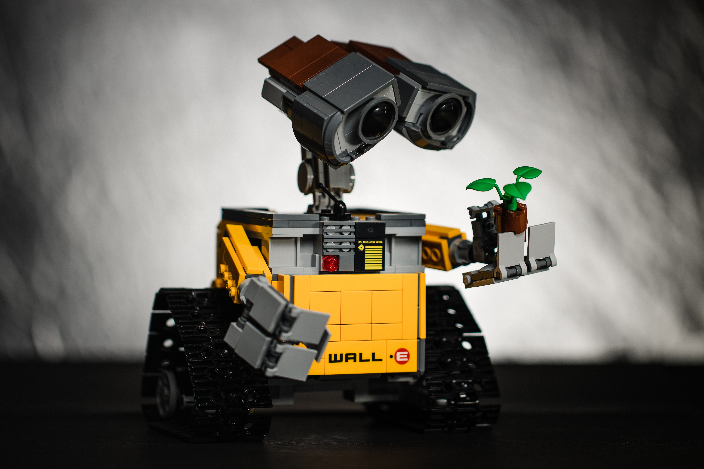
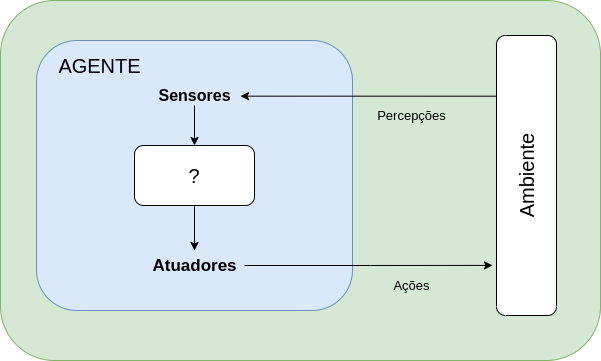
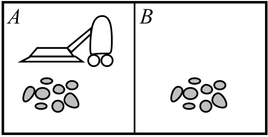
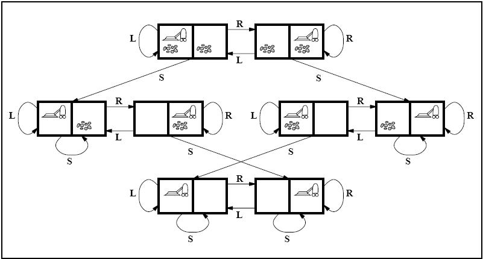
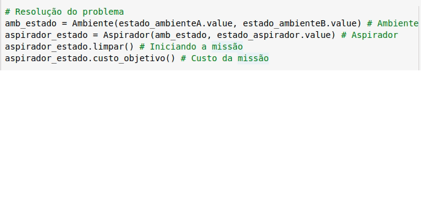

A **inteligência artificial** refere-se a inteligência humana aplicada
em máquinas, partindo dessa afirmação, não podemos nos dissociar do conceito
primitivo e básico de **inteligência** que nos convida a buscar conhecimento em uma área
tão fascinante:

##### _... do latim intelligentia, derivado das palavras inter que quer dizer ”entre” e eligere que quer dizer ”escolher”..._

{:.center bordered}

{:.center}
"Escolher entre"

<!-- ##### ... capacidade de extrair informações, aprender com a experiência, adaptar-se ao ambiente, compreender e utilizar corretamente o pensamento e a razão ... -->

Do processo de escolha entre possibilidades, conclui-se que a inteligência parte da escolha
mais adequada entre estados de um problema.

#### Quem faz a escolha adequada? A teoria sobre o agente.

A escolha mais adequada é feita pelo agente, agir é o centro do conceito _inteligência artificial_.

### Agente Inteligente

{:.center}

Um agente é tudo que pode ser considerado capaz de perceber o ambiente ao seu redor. A percepção é feita por meio de _sensores_ e a _interação_ com o ambiente é feita por meio dos _atuadores_.

- **Percepção** : A percepção aplicada em função do agente refere-se a todas as entradas perceptivas do agente em um dado instante
- **Ambiente** : Os ambientes são essencialmente os "problemas" para os quais os agentes racionais são as soluções

Alguns exemplos de agentes:
  
> "O agente humano possui olhos, ouvidos e outros orgãos que funcionam como os sensores. As mãos, pernas, boca e outras partes do corpo servem como atuadores."

> "Um agente robótico possui câmeras e outros tipos de sensores externos que servem como sensores e vários motores que são os atuadores."

> "Um agente de sofware recebe sequência de teclas digitadas, conteúdo de arquivos e pacotes de rede como entradas sensoriais e atua exibindo algo na tela, escrevendo em arquivos ou enviando pacotes de rede."

Os dois conceitos básicos do agente:

- **Função do agente** : A função do agente especifica a ação executada pelo agente em resposta a qualquer sequência de percepções. É uma descrição matemática abstrata.

{:.center}

{:.center}
Função do agente

- **Programa do agente** : O programa do agente é uma implementação concreta executada em um sistema físico.

{:.center}

{:.center}
Programa do agente

Para ficar mais clara a implementação do agente inteligente, é possível citar o problema de _mundo simplificado do aspirador de pó_

### Problema de mundo simplificado

O _agente inteligente_ aspirador de pó precisa executar a sua missão de aspirar um determinado _ambiente_. É possível criar inúmeras variações para esta situação. Por se tratar de um mundo simplificado, serão definidos dois quadrados A e B que representarão apenas dois ambientes. A função do aspirador é perceber em qual ambiente se encontra e se existir sujeira no quadrado, aspirar. Ele pode optar por mover-se para a esquerda, para direita, aspirar a sujeira ou não fazer nada.

{:.center}

Existem 8 estados possíveis para esse problema:

{:.center}

O posicionamento do aspirador em um dos 8 estados resulta em uma solução específica, de forma
resumida, o aspirador **percebe** o **ambiente** através dos **sensores** e aspira o ambiente
através dos **atuadores**. A sequir é possível ver um exemplo do _estado 1_ em que os dois
ambientes estão sujos e o aspirador se encontra no primeiro ambiente:

{:.center}

***

### Conclusão

A Inteligência Computacional pode melhorar a
vida do ser humano e sua relação com o planeta. Os avanços 
da Inteligência Computacional são cada vez mais
impactantes, juntamente a outras áreas da Inteligência 
Artificial. A construção do conhecimento nessa área é fundamental
para o avanço tecnológicoA.

##### Referências

NORVIG, Peter; RUSSELL, Stuart. Inteligência artificial. Editora Campus, v. 20, 2004.

  

    <table class="table-borderless highlight">
      <thead>
        <tr>
            <th>
<a href="https://www.linkedin.com/in/anderson-lima-45278b1bb/" target="_blank">
                

                    
                

            </a>
</th>
        </tr>
      </thead>
      <tbody>
        <tr class="font-weight-bolder" style="text-align: center; margin-top: 0">
          <td width="33.33%">Anderson Lima</td>
        </tr>
        <tr style="text-align: center" >
          <td style="vertical-align: top;text-align: justify;"><small>Pesquisador Júnior no laboratório de Robótica e Sistemas Autônomos (RoSA), Senai Cimatec, graduado em Engenharia Civil.</small></td>
        </tr>
      </tbody>
    </table>
  

 